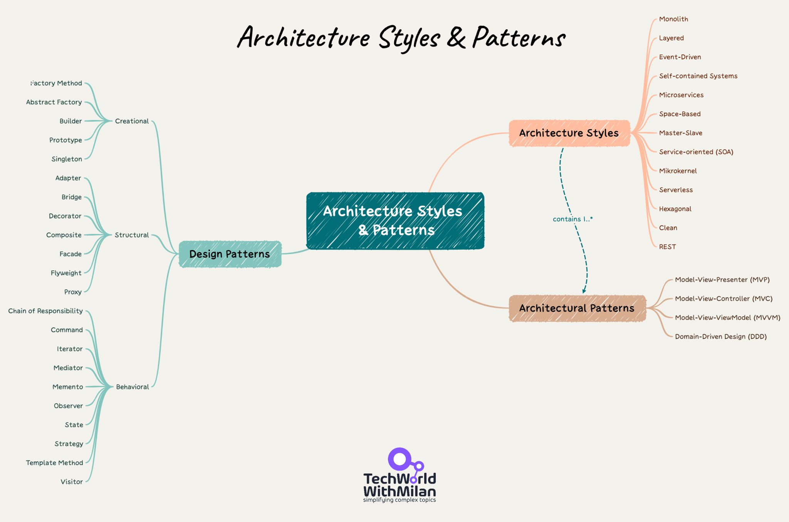
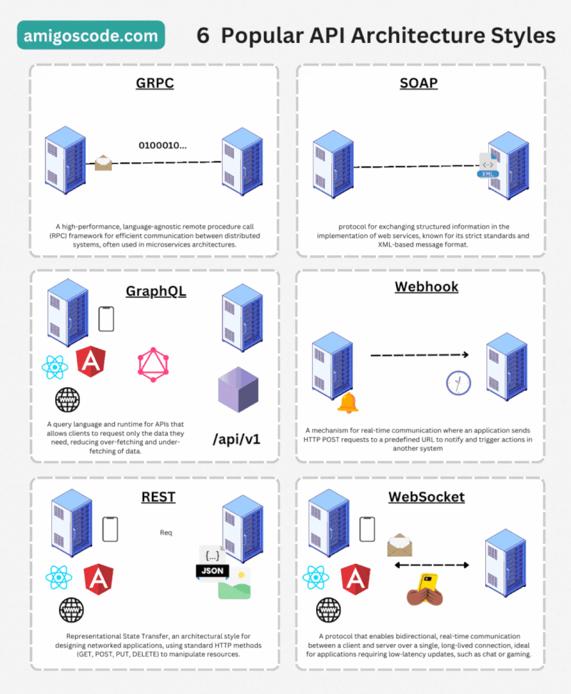

# Despliegue de Aplicaciones Web - 01 - Introducción al despliegue de aplicaciones web

Tema 01. Introducción al despliegue de aplicaciones web. 2DAW. Curso 2024/2025.

- [Despliegue de Aplicaciones Web - 01 - Introducción al despliegue de aplicaciones web](#despliegue-de-aplicaciones-web---01---introducción-al-despliegue-de-aplicaciones-web)
  - [Introducción](#introducción)
    - [Definición](#definición)
    - [Objetivos](#objetivos)
    - [Importancia en el Desarrollo Actual](#importancia-en-el-desarrollo-actual)
  - [Tipos de Arquitecturas Web](#tipos-de-arquitecturas-web)
    - [Arquitectura Monolítica](#arquitectura-monolítica)
    - [Arquitectura de capas](#arquitectura-de-capas)
    - [Arquitectura de servicios web](#arquitectura-de-servicios-web)
    - [Arquitectura de Microservicios](#arquitectura-de-microservicios)
    - [Arquitectura Serverless](#arquitectura-serverless)
    - [Ejemplo de arquitectura de Netflix](#ejemplo-de-arquitectura-de-netflix)
    - [API Web](#api-web)
  - [Tipos de Despliegue](#tipos-de-despliegue)
    - [Despliegue de Páginas](#despliegue-de-páginas)
  - [Despliegue en Contenedores o Nube](#despliegue-en-contenedores-o-nube)
      - [Despliegue en Contenedores](#despliegue-en-contenedores)
      - [Despliegue en la Nube](#despliegue-en-la-nube)
  - [Introducción a la Integración Continua/ Despliegue Continuo](#introducción-a-la-integración-continua-despliegue-continuo)
    - [Integración Continua (CI)](#integración-continua-ci)
    - [Entrega Continua (CD)](#entrega-continua-cd)
    - [Despliegue Continuo](#despliegue-continuo)
  - [Autor](#autor)
    - [Contacto](#contacto)
  - [Licencia de uso](#licencia-de-uso)

## Introducción
El despliegue de aplicaciones web es uno de los procesos más críticos en el ciclo de vida del desarrollo de software. Consiste en transferir una aplicación desde el entorno de desarrollo a un entorno de producción, donde la aplicación es accesible para los usuarios finales. Este proceso es complejo e involucra varias etapas, desde la configuración del servidor hasta la verificación de que todos los servicios y componentes estén operativos.

### Definición
El despliegue de aplicaciones web es una serie de procesos y tecnologías utilizadas para transferir una aplicación web desde el entorno de desarrollo a un entorno de producción. Este proceso incluye la instalación y configuración del servidor, la implementación del código, la configuración de la base de datos y, en algunos casos, la configuración de redes y seguridad.

### Objetivos
El despliegue de aplicaciones web tiene varios objetivos clave que son esenciales para el éxito del proyecto:

- Accesibilidad: Asegurar que la aplicación esté disponible y accesible para los usuarios finales.
- Estabilidad: Garantizar que la aplicación funcione de manera consistente y predecible en el entorno de producción.
- Escalabilidad: Facilitar el crecimiento de la aplicación a medida que aumenta la demanda.
- Seguridad: Proteger la aplicación y sus datos contra amenazas potenciales.
- Automatización: Minimizar la intervención manual para reducir errores y aumentar la eficiencia.

### Importancia en el Desarrollo Actual
En el contexto actual del desarrollo de software, el despliegue de aplicaciones web juega un papel crucial por varias razones:

- Rapidez en el Time-to-Market: Los despliegues rápidos permiten que las empresas lleguen al mercado más rápidamente.
- Iteración Rápida: Facilita la entrega continua de nuevas funcionalidades y mejoras, permitiendo a las empresas adaptarse rápidamente a las necesidades del mercado y de los usuarios.
- Automatización: El despliegue automatizado reduce los errores humanos y aumenta la eficiencia, permitiendo que los equipos de desarrollo se centren en funciones más estratégicas.
- Competitividad: Un despliegue eficiente mejora la capacidad de una empresa para competir en el mercado al proporcionar un servicio confiable y de alta calidad.
- Documentación: Es esencial para asegurar que todos los procesos de despliegue estén claramente definidos y puedan ser replicados. La documentación ayuda en la resolución de problemas, en la formación de nuevos miembros del equipo y en el mantenimiento a largo plazo.

## Tipos de Arquitecturas Web
Una arquitectura de software se refiere a la estructura organizativa fundamental de un sistema de software. Define cómo se dividen, combinan y coordinan los componentes del software para lograr los objetivos del sistema. En el desarrollo de aplicaciones web del lado del servidor (backend)

Las aplicaciones web pueden ser construidas utilizando diferentes arquitecturas, cada una con sus propios pros y contras. Elegir la arquitectura adecuada es fundamental para satisfacer las necesidades específicas de la aplicación y la organización.

### Arquitectura Monolítica
En una arquitectura monolítica, todo el código de la aplicación se encuentra en un único proyecto o servidor. Esta arquitectura es más sencilla de implementar pero puede ser difícil de escalar y mantener a medida que la aplicación crece.

Ventajas:
- Facilidad de desarrollo y despliegue inicial.
- Simplifica el manejo de transacciones y sesiones.
- Menos sobrecarga en la comunicación entre componentes.

Desventajas:
- Dificultad para escalar componentes individuales.
- Mayor riesgo de fallos en toda la aplicación.
- Ciclos de despliegue más largos.
- Menor flexibilidad en la adopción de nuevas tecnologías.

### Arquitectura de capas
Esta arquitectura divide la aplicación en diferentes capas lógicas, donde cada capa tiene una responsabilidad específica. Las capas típicas incluyen la capa de presentación, la capa de lógica de negocio y la capa de acceso a datos. Cada capa se comunica con la capa adyacente a través de interfaces bien definidas. 

Ventajas:
- Mejora la modularidad y la reutilización del código.
- Permite cambios en una capa sin afectar a las demás.
- Facilita la escalabilidad y el mantenimiento del sistema.

Desventajas:
- Menor flexibilidad en la adopción de nuevas tecnologías.
- Menor mantenimiento del sistema.
- Menor escalabilidad.
- Menor flexibilidad para el cambio de tecnologías.

### Arquitectura de servicios web
Esta arquitectura se basa en la comunicación entre diferentes servicios a través de protocolos web estándar, como HTTP. Cada servicio es una unidad independiente que se puede desarrollar, desplegar y escalar de forma independiente. Los servicios se comunican entre sí para cumplir con los requisitos de la aplicación. 

Ventajas:
- Favorece la modularidad y la independencia de los servicios.
- Permite la integración de diferentes tecnologías y lenguajes de programación.
- Facilita la escalabilidad horizontal, ya que los servicios se pueden replicar y distribuir en múltiples servidores.

Desventajas:
- Depende de la arquitectura y protocolos de la web.
- Menor flexibilidad al usar solo protocolos http

### Arquitectura de Microservicios
La arquitectura de microservicios divide la aplicación en múltiples servicios pequeños e independientes que interactúan entre sí. Cada microservicio es responsable de una funcionalidad específica y puede ser desarrollado, desplegado y escalado de manera independiente.

Ventajas:
- Escalabilidad independiente.
- Facilita el desarrollo y la implementación por equipos separados.
- Mayor resiliencia, ya que el fallo de un servicio no afecta a toda la aplicación.
- Flexibilidad para usar diferentes tecnologías y lenguajes en diferentes microservicios.

Desventajas:
- Mayor complejidad en la gestión y el despliegue.
- Requiere una configuración de infraestructura avanzada.
- Aumenta la sobrecarga de comunicación entre servicios.
- Problemas de consistencia y transacciones distribuidas.

### Arquitectura Serverless
En una arquitectura serverless, las operaciones del servidor están completamente gestionadas por un proveedor de nube. Los desarrolladores no tienen que preocuparse por la infraestructura, sino solo por el código de la aplicación.

Ventajas:
- Escalabilidad automática.
- Pago por uso: solo se cobran los recursos utilizados.
- Alto nivel de abstracción en la gestión de infraestructura.
- Reducción de la complejidad en el despliegue y la administración del servidor.

Desventajas:
- Dependencia del proveedor de servicios.
- Limitaciones en el tiempo de ejecución y recursos.
- Latencia de arranque en frío.
- Desafíos en el monitoreo y la depuración.

### Ejemplo de arquitectura de Netflix
La arquitectura de backend de Netflix es conocida por ser altamente escalable y resiliente, diseñada para manejar grandes volúmenes de tráfico y garantizar la disponibilidad y el rendimiento de sus servicios. Netflix adopta una arquitectura basada en microservicios, donde las diferentes funcionalidades se dividen en servicios independientes. Cada microservicio se enfoca en una tarea específica y se comunica con otros servicios a través de interfaces bien definidas. Esto permite una mayor flexibilidad, escalabilidad y mantenimiento de los servicios individuales.

### API Web
Una API web (Application Programming Interface) es un conjunto de reglas y protocolos que permite a diferentes aplicaciones o sistemas comunicarse y compartir datos entre sí a través de la web. Proporciona un conjunto de funciones y métodos que permiten a los desarrolladores acceder y manipular los datos de una aplicación o servicio específico.

En el contexto de las aplicaciones web, una API web permite que el backend de una aplicación exponga ciertas funcionalidades y datos a otras aplicaciones o servicios, como aplicaciones móviles, sitios web o sistemas externos. Esto permite la integración y la creación de aplicaciones más complejas y robustas.

Las API web se basan en protocolos estándar de la web, como HTTP (Hypertext Transfer Protocol), y utilizan formatos de intercambio de datos como JSON (JavaScript Object Notation) o XML (eXtensible Markup Language) para enviar y recibir información.

Algunos ejemplos comunes de API web incluyen:

1. API RESTful: Es un estilo arquitectónico que utiliza los métodos HTTP (GET, POST, PUT, DELETE, etc.) para acceder y manipular recursos en un sistema. Se basa en la representación de recursos a través de URLs (Uniform Resource Locators) y utiliza formatos como JSON para el intercambio de datos.

2. API GraphQL: Es un lenguaje de consulta y una especificación para las APIs web. Permite a los clientes solicitar y recibir solo los datos necesarios, lo que mejora la eficiencia y reduce la cantidad de datos transferidos.
   
3. API Websocket: Utiliza el protocolo de comunicación de WebSockets para permitir una comunicación bidireccional y en tiempo real entre un cliente y un servidor a través de una conexión persistente. A diferencia de las API tradicionales basadas en HTTP, que siguen un modelo de solicitud-respuesta, las API con WebSockets establecen una conexión continua entre el cliente y el servidor, lo que permite una comunicación más eficiente y en tiempo real.

Las API web son fundamentales en el desarrollo de aplicaciones modernas, ya que permiten la integración de diferentes servicios y la creación de aplicaciones más flexibles y escalables.

## Tipos de Despliegue
El despliegue de aplicaciones web puede variar según el contexto de la aplicación y la infraestructura disponible. Aquí se presentan dos tipos principales:

### Despliegue de Páginas
El despliegue de páginas web estáticas se refiere a la publicación de contenido que no cambia dinámicamente. Este tipo de despliegue es más sencillo y se utiliza para sitios web informativos, blogs y páginas de destino.
- Tecnologías comunes: HTML, CSS, JavaScript
- Hosting: Proveedores como GitHub Pages, Netlify, y Vercel.
Proceso de Despliegue:
- Desarrollo de la Página Web: Se crean los archivos HTML, CSS y JavaScript necesarios.
- Subida de Archivos al Servidor de Hosting: Estos archivos se suben a un servidor de hosting mediante FTP, Git o una plataforma de despliegue.
- Configuración del Dominio: Se configura un dominio para hacer que la página sea accesible públicamente.
- Configuración Opcional de CDN y SSL: Para mejorar el rendimiento y la seguridad, se puede configurar una red de distribución de contenido (CDN) y un certificado SSL.
- Documentación: Es fundamental documentar cada paso del proceso para asegurar la repetibilidad y facilitar la resolución de problemas futuros.

## Despliegue en Contenedores o Nube
El despliegue en entornos de contenedores o nube es más complejo y se utiliza para aplicaciones dinámicas que requieren escalabilidad y flexibilidad.

#### Despliegue en Contenedores
- Tecnologías comunes: Docker, Kubernetes.

Ventajas:
- Portabilidad.
- Consistencia entre entornos de desarrollo y producción.
- Mejor uso de recursos.

Proceso de Despliegue:
- Creación de una Imagen del Contenedor con Docker: Se escriben Dockerfiles para definir la imagen del contenedor.
Publicación de la Imagen en un Registro de Contenedores: La imagen se sube a un registro de contenedores como Docker Hub o un registro privado.
- Despliegue de la Imagen en un Servicio de Orquestación como Kubernetes: Se utilizan archivos de configuración de Kubernetes (YAML) para desplegar la imagen en un cluster de Kubernetes.
- Configuración de Autoscaling y Load Balancing: Se configuran políticas de escalado y balanceadores de carga para gestionar el tráfico y la demanda.
- Monitoreo y Logging: Se implementan herramientas de monitoreo y logging para asegurarse de que la aplicación funcione correctamente.
- Documentación: Se documentan todas las configuraciones y procedimientos para la gestión continua y el onboarding de nuevos miembros del equipo.

#### Despliegue en la Nube

- Proveedores comunes: AWS, Google Cloud, Azure.

Ventajas:
- Escalabilidad automática.
- Servicios gestionados (bases de datos, colas, almacenamiento).
- Alta disponibilidad.

Proceso de Despliegue:
- Configuración de la Infraestructura en la Nube: Creación de instancias de servidor, bases de datos y otros recursos necesarios.
- Implementación del Código mediante Servicios como AWS Elastic Beanstalk o Google App Engine: Uso de servicios PaaS para simplificar el despliegue y la gestión de la aplicación.
- Configuración de Autoscaling, Balanceadores de Carga y otros Servicios Auxiliares: Ajustes para manejar la carga y asegurar la disponibilidad.
- Configuración de Seguridad: Implementación de políticas de seguridad, firewalls y certificados SSL.
- Pruebas y Validación: Ejecución de pruebas exhaustivas para garantizar la funcionalidad y el rendimiento en el entorno de producción.
- Monitoreo y Alerta: Uso de herramientas de monitoreo para detectar problemas en tiempo real y configurar alertas.
- Documentación: Registro detallado de todas las configuraciones y procesos para facilitar la gestión continua y futuras iteraciones.

## Introducción a la Integración Continua/ Despliegue Continuo
La Integración Continua (CI) y la Entrega/Despliegue Continuo (CD) son prácticas DevOps que buscan automatizar y mejorar el proceso de desarrollo y despliegue de aplicaciones. Estas prácticas son esenciales para mantener un ciclo de vida de desarrollo eficiente y de alta calidad.

### Integración Continua (CI)
La CI implica la integración de cambios pequeños y frecuentes de código en el repositorio central, asegurando que cada cambio pase por un conjunto de pruebas automatizadas.

- Tecnologías comunes: Jenkins, Travis CI, CircleCI.

Beneficios:
- Detección temprana de errores.
- Menor integración manual.
- Garantiza que el código siempre esté en un estado desplegable.

Proceso de CI:
- Commit de Código: Los desarrolladores hacen commits frecuentes de sus cambios en el repositorio de código.
- Construcción Automática: Cada commit dispara automáticamente una construcción de la aplicación.
- Ejecución de Pruebas Automatizadas: Se ejecutan pruebas unitarias, de integración y funcionales para validar el código.
- Reporte de Estado: Los resultados de las pruebas se reportan al equipo de desarrollo.
- Documentación: Mantener una documentación clara de todas las pruebas y configuraciones CI ayuda en la resolución de problemas y asegura que nuevas funcionalidades no rompan las existentes.

### Entrega Continua (CD)
La CD asegura que el código siempre esté en un estado que pueda ser lanzado a producción en cualquier momento.

- Relación con CI: Después de que el código pasa las pruebas CI, se coloca en un entorno de staging o producción.
- Tecnologías comunes: AWS CodePipeline, GitLab CI, Jenkins.

Beneficios:
- Feedback rápido.
- La aplicación está siempre lista para ser desplegada con confianza.

Proceso de CD:
- Pruebas Automatizadas Post-CI: A parte de las pruebas CI, se llevan a cabo pruebas adicionales de regresión, rendimiento y seguridad.
- Despliegue a Entornos de Staging: El código aprobado se despliega a un entorno de staging para pruebas de aceptación.
- Revisión y Aprobación Manual: En algunos casos, un paso de aprobación manual es necesario antes del despliegue a producción.
- Documentación: Documentar cada fase del proceso CD para asegurar que todos los miembros del equipo entiendan el flujo y puedan mantenerlo.

### Despliegue Continuo
El despliegue continuo va un paso más allá de la entrega continua; cada cambio que pasa la pipeline de CI/CD se despliega automáticamente a producción.

Beneficios:
- Reducción de tiempos de espera.
- Incremento en la frecuencia de despliegues.
- Reducción de riesgos asociados con despliegues grandes y menos frecuentes.

Proceso de Despliegue Continuo:
- Pipeline CI/CD: Configuración de una pipeline que incluye pruebas, construcción, validación y despliegue automático.
- Monitoreo Continuo: Implementar herramientas de monitoreo y logging para detectar y resolver problemas en tiempo real.
Rolling Updates y Canary Releases: Usar técnicas como actualizaciones continuas y lanzamientos canarios para minimizar el impacto de nuevos cambios.
- Pruebas y Validación en Producción: Validar cambios en producción mediante pruebas automatizadas y de monitoreo.
- Documentación: Mantener documentación exhaustiva de todo el pipeline de despliegue continuo y los procedimientos de rollback para mitigar riesgos.

## Autor

Codificado con :sparkling_heart: por [José Luis González Sánchez](https://twitter.com/JoseLuisGS_)

### Contacto

  Cualquier cosa que necesites házmelo saber por si puedo ayudarte 💬.

   &nbsp;&nbsp;
     &nbsp;&nbsp;
         &nbsp;&nbsp;
      &nbsp;&nbsp;
      &nbsp;&nbsp;
  

## Licencia de uso

Este repositorio y todo su contenido está licenciado bajo licencia **Creative Commons**, si desea saber más, vea
la [LICENSE](https://joseluisgs.dev/docs/license/). Por favor si compartes, usas o modificas este proyecto cita a su
autor, y usa las mismas condiciones para su uso docente, formativo o educativo y no comercial.

 
JoseLuisGS
by <a xmlns:cc="http://creativecommons.org/ns#" href="https://joseluisgs.dev/" property="cc:attributionName" rel="cc:attributionURL">
José Luis González Sánchez</a> is licensed under
a <a rel="license" href="http://creativecommons.org/licenses/by-nc-sa/4.0/">Creative Commons
Reconocimiento-NoComercial-CompartirIgual 4.0 Internacional License</a>. Creado a partir de la obra
en <a xmlns:dct="http://purl.org/dc/terms/" href="https://github.com/joseluisgs" rel="dct:source">https://github.com/joseluisgs</a>.